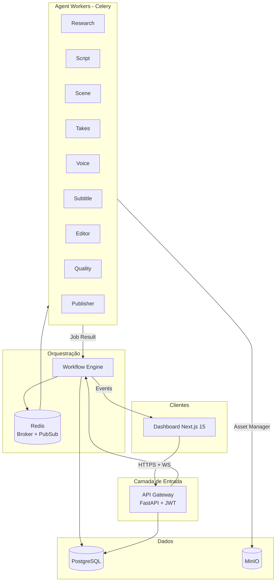

# ContentOS — Arquitetura do Sistema

> **V2:** pipeline dinâmico de 14 steps, AI Gateway, Content Sources e Asset Manager V2 — ver [ARCHITECTURE_V2.md](./ARCHITECTURE_V2.md), [FLOW.md](./FLOW.md) e [NAMING.md](./NAMING.md).

## Visão Geral

ContentOS é uma **fábrica de conteúdo** SaaS baseada em agentes de IA independentes. Cada agente é um **microserviço desacoplado** que nunca se comunica diretamente com outro agente. Toda orquestração passa pelo **Workflow Engine**.


### Princípios

| Princípio | Implementação |
|-----------|---------------|
| Clean Architecture | Camadas: Domain → Application → Infrastructure → Presentation |
| SOLID | Um agente = uma responsabilidade; interfaces para storage, TTS, video source |
| Design Patterns | Gateway, Strategy, Repository, Factory, Observer (WebSocket), CQRS (jobs) |
| Escalabilidade | Filas Celery por agente, workers horizontalmente escaláveis |
| Produção | Retry, DLQ, observabilidade, idempotência, health checks |

---

## Diagrama de Contexto



---

## Fluxo de Comunicação (Regra de Ouro)

```
Dashboard → API Gateway → Workflow Engine → Redis → Celery → Agente
                                                              ↓
Agente → Asset Manager → MinIO
Agente → Workflow Engine (callback) → PostgreSQL + WebSocket → Dashboard
```

**Proibido:** Agente A chamar Agente B diretamente.

---

## Monorepo

```
ContentOS/
├── apps/
│   ├── backend/              # API Gateway (auth, routing, WS hub)
│   └── dashboard/            # Next.js 15 + Shadcn UI
├── services/
│   ├── workflow-engine/      # Orquestrador central
│   ├── research-agent/
│   ├── script-agent/
│   ├── scene-agent/
│   ├── takes-agent/
│   ├── voice-agent/
│   ├── subtitle-agent/
│   ├── editor-agent/
│   ├── quality-agent/
│   └── publisher-agent/
├── packages/
│   ├── shared/               # Contratos, eventos, enums, DTOs
│   ├── database/             # Models SQLAlchemy + Alembic
│   └── storage/              # Asset Manager + MinIO client
├── docker/
├── docs/
└── tests/
```

---

## Workflow Engine

### Responsabilidades

1. Criar **Jobs** e **Pipelines** (sequência de steps)
2. Enfileirar tasks Celery na fila correta (`contentos.research`, etc.)
3. Receber **callbacks** dos agentes com `JobResult`
4. Avançar pipeline para o próximo step
5. Gerenciar **Retry** (exponential backoff, max 3)
6. Enviar falhas definitivas para **Dead Letter Queue**
7. Publicar eventos WebSocket

### Estados do Job

```
PENDING → RUNNING → COMPLETED
                 ↘ FAILED → RETRYING → RUNNING
                          ↘ FAILED (max retries) → DLQ
                 ↘ CANCELLED
```

### Pipeline Padrão (9 steps)

```
research → script → scene → takes → voice → subtitle → editor → quality → publisher
```

---

## Asset Manager

Abstração única sobre MinIO. **Nenhum agente acessa arquivos diretamente.**

### Buckets / Prefixos

| Prefixo | Conteúdo |
|---------|----------|
| `assets/` | Metadados genéricos |
| `takes/` | Clips de vídeo por tema |
| `audio/` | Narrações MP3 |
| `scripts/` | Roteiros JSON |
| `videos/` | Vídeos intermediários |
| `renders/` | Vídeos finais 1080x1920 |
| `images/` | Imagens / thumbnails |
| `thumbs/` | Miniaturas |
| `captions/` | SRT + JSON sincronizado |
| `temp/` | Arquivos temporários (TTL 24h) |

### Interface (Strategy Pattern)

```python
class AssetManager(Protocol):
    async def store(self, category: AssetCategory, data: bytes, metadata: AssetMeta) -> AssetRef
    async def get(self, ref: AssetRef) -> bytes
    async def get_url(self, ref: AssetRef, expires: int = 3600) -> str
    async def delete(self, ref: AssetRef) -> None
    async def list_by_project(self, project_id: UUID, category: AssetCategory) -> list[AssetRef]
```

Implementação: `MinIOAssetManager`.

---

## API Gateway

| Rota | Responsabilidade |
|------|------------------|
| `/api/v1/auth/*` | JWT + Refresh Token |
| `/api/v1/projects/*` | CRUD projetos |
| `/api/v1/jobs/*` | Consulta jobs/pipelines |
| `/api/v1/assets/*` | Proxy para Asset Manager |
| `/api/v1/analytics/*` | Métricas agregadas |
| `/ws` | WebSocket tempo real |

Não contém lógica de agentes.

---

## Agentes (Microserviços Celery)

Cada agente:

```
services/{name}-agent/
├── Dockerfile
├── pyproject.toml
├── src/
│   ├── domain/           # Entidades e regras puras
│   ├── application/      # Use cases
│   ├── infrastructure/   # Provider adapters via Factory (Ollama, Piper, FFmpeg)
│   └── worker.py         # Celery task entrypoint
└── tests/
```

### Contrato de Entrada/Saída

```python
@dataclass
class AgentTaskInput:
    job_id: UUID
    pipeline_id: UUID
    project_id: UUID
    step: PipelineStep
    payload: dict[str, Any]      # Output do step anterior (via Workflow)
    config: dict[str, Any]

@dataclass
class AgentTaskOutput:
    job_id: UUID
    status: JobStatus
    artifacts: list[AssetRef]    # Referências no Asset Manager
    data: dict[str, Any]         # Metadados para próximo step
    logs: list[str]
    error: str | None = None
```

---

## Banco de Dados (PostgreSQL)

| Tabela | Propósito |
|--------|-----------|
| `users` | Autenticação, roles (admin/editor/viewer) |
| `projects` | Projetos de conteúdo |
| `videos` | Vídeos finais e metadados |
| `scripts` | Roteiros gerados |
| `scenes` | Cenas com timestamps |
| `jobs` | Execuções individuais de agentes |
| `pipelines` | Sequência completa de produção |
| `assets` | Registro de assets no MinIO |
| `audio` | Narrações |
| `subtitles` | Legendas SRT/JSON |
| `logs` | Logs estruturados por job |
| `settings` | Configurações por projeto/usuário |
| `channels` | Canais de publicação (TikTok, YT, IG) |
| `templates` | Templates de roteiro/estilo |
| `analytics` | Métricas agregadas |

---

## Autenticação

- **Access Token** JWT (15 min)
- **Refresh Token** (7 dias, rotativo, armazenado hashed)
- **RBAC**: `admin` | `editor` | `viewer`
- Middleware no Gateway valida token antes de rotear

---

## Escalabilidade (milhares de vídeos/dia)

| Componente | Estratégia |
|------------|------------|
| Agent Workers | `--scale research-agent=4` via Docker/K8s |
| Redis | Cluster mode em produção |
| PostgreSQL | Read replicas + connection pooling (PgBouncer) |
| MinIO | Distributed mode |
| FFmpeg | Workers dedicados com GPU (nvidia-docker) |
| Filas | Uma fila por agente = backpressure isolado |
| DLQ | Monitoramento + reprocessamento manual |

---

## Decisões Técnicas

### Por que monorepo?
Contratos compartilhados (`packages/shared`), migrations centralizadas, CI único.

### Por que Celery e não Kafka?
Celery + Redis atende o volume inicial com simplicidade operacional. Interface de eventos abstrata permite migrar para Kafka/RabbitMQ sem alterar agentes.

### Por que MinIO?
S3-compatible, self-hosted, ideal para assets de mídia grandes.

### Por que Workflow Engine separado?
Single Responsibility: Gateway autentica, Workflow orquestra. Permite escalar orquestração independentemente.

### Por que Python 3.13 no Docker?
Performance improvements + typing. Local dev via Docker evita incompatibilidades de dependências nativas.

---

## AI Providers Layer

Toda IA é acessada via **ProviderFactory** (Strategy + DI). Agentes nunca chamam Ollama, Whisper ou Piper diretamente.

```
providers/
├── protocols.py     # TextProvider, SpeechProvider, SubtitleProvider
├── factory.py       # seleção via env
├── ai/              # Ollama (default), OpenAI
├── speech/          # Piper (default), ElevenLabs
└── subtitle/        # Local Whisper (default), OpenAI Whisper
```

Ver [PROVIDERS.md](./PROVIDERS.md).

---

## Próximos Documentos

- [FLOW.md](./FLOW.md) — Fluxograma detalhado do pipeline
- [AGENTS.md](./AGENTS.md) — Especificação de cada agente
