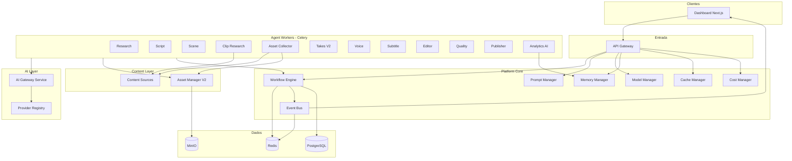
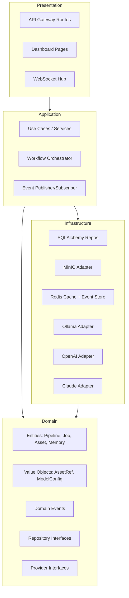
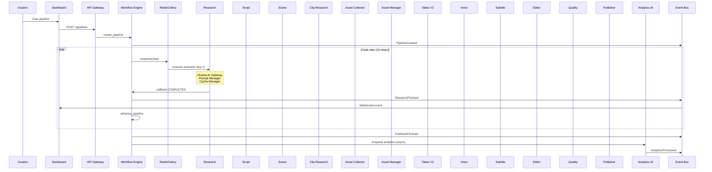
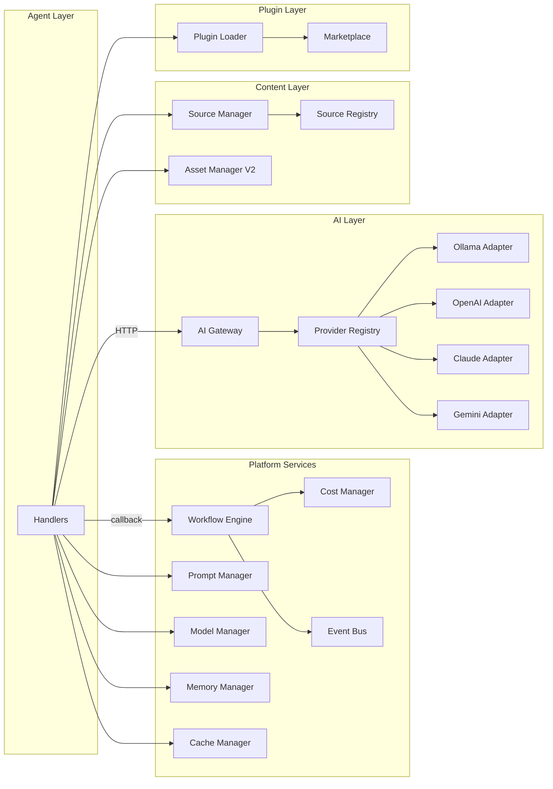
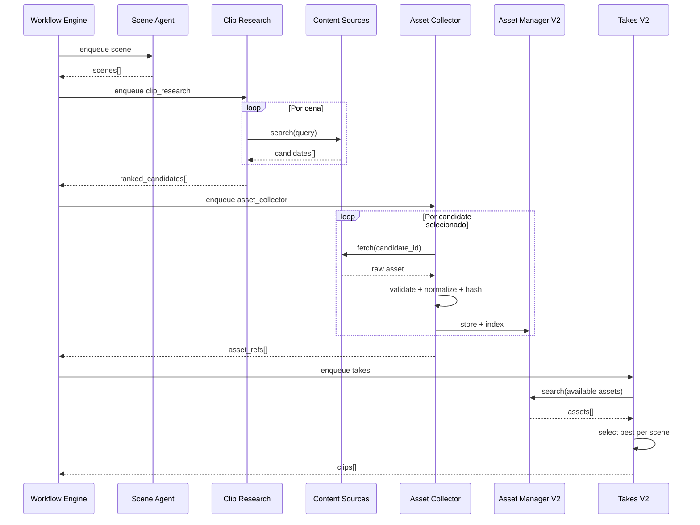

# ContentOS V2 — Plano Arquitetural

> **Status:** Implementado (Fases 7–12)  
> **Princípio:** Expandir, nunca remover funcionalidade V1  
> **Atualizado:** 2026-07-03 — Asset pipeline E2E, AI Gateway unificado, Image/Vision/Embedding, dashboard `/assets` + workflow V2, docs


---

## 1. Análise da Arquitetura Atual (V1)

### 1.1 O que existe hoje

| Camada | Implementação atual | Observação |
|--------|---------------------|------------|
| API | `apps/backend` — FastAPI Gateway | JWT, REST, WebSocket |
| Dashboard | `apps/dashboard` — Next.js 15 | 14 páginas |
| Orquestração | `services/workflow-engine` | Pipeline fixo 9 steps |
| Agentes | `services/agents-worker` — worker unificado | 9 handlers Celery |
| Providers | `packages/shared/providers` | Factory env-based (Ollama/Piper/Whisper) |
| Plugins | `packages/shared/plugins` | TikTok/YouTube/Instagram estáticos |
| Storage | `packages/storage` | MinIO via AssetManager |
| DB | `packages/database` | 18 models (vários não usados) |
| Eventos | Redis pub/sub `contentos:events` | Apenas WorkflowEvent básico |

### 1.2 Pipeline V1 (9 steps — template `v1-default`)

```
research → script → scene → takes → voice → subtitle → editor → quality → publisher
```

Configurável via **WorkflowDefinition** e env `DEFAULT_WORKFLOW`. Templates built-in: `v1-default`, `v2-full`, `v2-dynamic` (16 steps).

### 1.3 Gaps identificados (motivação V2)

| Gap | Impacto |
|-----|---------|
| Agentes chamam Ollama/Piper via ProviderFactory local | Viola isolamento; impede multi-modelo por agente |
| Prompts hardcoded nos handlers | Requer redeploy para ajustar |
| `ProviderConfig` e `WorkflowDefinition` no DB não usados | Modelos mortos |
| Takes agent pesquisa + coleta + seleciona | Viola SRP |
| Sem Content Sources abstrato | Acoplado a MinIO/takes library |
| Eventos limitados (`step.started/completed`) | Sem Event Bus formal |
| Artifacts não persistidos na tabela `assets` | Storage incompleto |
| Plugins hardcoded no loader | Sem marketplace |

### 1.4 Regra de ouro V1 (mantida na V2)

```
Dashboard → API Gateway → Workflow Engine → Redis/Celery → Agente
Agente → callback → Workflow Engine → DB + Event Bus → Dashboard
```

**Proibido:** Agente A → Agente B (direto).

---

## 2. Visão V2 — Princípios

| Princípio | Aplicação |
|-----------|-----------|
| **Clean Architecture** | Domain → Application → Infrastructure → Presentation |
| **DDD** | Bounded contexts por módulo (AI, Content, Workflow, Platform) |
| **SOLID** | Um agente = uma responsabilidade; interfaces para tudo |
| **DI** | Injeção via factories/registries, nunca `import` direto de infra |
| **Strategy** | Providers, Content Sources, Plugins swappable |
| **Adapter** | Ollama/OpenAI/MinIO/RSS → interfaces comuns |
| **Factory + Registry** | Descoberta e instanciação desacoplada |
| **Repository** | Persistência atrás de interfaces |
| **Event Driven** | Event Bus entre agentes e dashboard |
| **Backward compat** | Pipeline V1 continua como `workflow/v1-default` |

---

## 3. Diagrama de Contexto V2



---

## 4. Diagrama de Camadas (Clean Architecture)



---

## 5. Pipeline V2 — Novo Fluxo



### Steps V2 (14 + analytics async)

| # | Step | Agente | AI via Gateway | Novo? |
|---|------|--------|----------------|-------|
| 1 | research | Research | TextProvider | — |
| 2 | script | Script | TextProvider | — |
| 3 | scene | Scene Planner | TextProvider | — |
| 4 | clip_research | Clip Research | Text + Vision | **SIM** |
| 5 | asset_collector | Asset Collector | — (Content Sources) | **SIM** |
| 6 | asset_index | Asset Manager | — | **SIM** |
| 7 | takes | Takes Manager V2 | — | Modificado |
| 8 | voice | Voice | SpeechProvider | — |
| 9 | subtitle | Subtitle | SubtitleProvider | — |
| 10 | editor | Editor | FFmpegProvider | — |
| 11 | quality | Quality | — | — |
| 12 | publisher | Publisher | TextProvider + Plugins | — |
| 13 | thumbnail | Thumbnail | ImageProvider | **SIM** (opcional) |
| 14 | analytics | Analytics AI | TextProvider | **SIM** (async) |

**Compat V1:** Workflow `v1-default` mantém 9 steps originais sem clip_research/asset_collector.

---

## 6. Módulos V2 — Especificação

### 6.1 AI Gateway (serviço novo)

**Responsabilidade:** Único ponto de contato com modelos de IA.

```
Agente → HTTP/gRPC → AI Gateway → ProviderRegistry → Adapter (Ollama/OpenAI/Claude/...)
```

**Interfaces (domain):**

```python
# packages/ai-core/src/contentos_ai/domain/providers.py
class AIProvider(Protocol): ...
class TextProvider(AIProvider): async def chat_json(...) -> dict
class ImageProvider(AIProvider): async def generate_image(...) -> bytes
class SpeechProvider(AIProvider): async def text_to_speech(...) -> bytes
class SubtitleProvider(AIProvider): async def transcribe(...) -> dict
class VisionProvider(AIProvider): async def analyze_image(...) -> dict
class EmbeddingProvider(AIProvider): async def embed(...) -> list[float]
```

**Providers suportados (adapters):**

| Provider | Text | Image | Speech | Subtitle | Vision | Embed |
|----------|------|-------|--------|----------|--------|-------|
| Ollama | ✓ | — | — | — | ✓ | ✓ |
| OpenAI | ✓ | ✓ | — | ✓ | ✓ | ✓ |
| Claude | ✓ | — | — | — | ✓ | — |
| Gemini | ✓ | ✓ | — | — | ✓ | ✓ |
| DeepSeek | ✓ | — | — | — | — | ✓ |
| Mistral | ✓ | — | — | — | — | ✓ |
| Llama (via Ollama) | ✓ | — | — | — | ✓ | ✓ |
| Qwen (via Ollama) | ✓ | — | — | — | ✓ | ✓ |
| Piper | — | — | ✓ | — | — | — |
| Whisper | — | — | — | ✓ | — | — |
| ElevenLabs | — | — | ✓ | — | — | — |

**API AI Gateway:**

```
POST /v1/text/chat
POST /v1/text/chat-json
POST /v1/speech/tts
POST /v1/subtitle/transcribe
POST /v1/vision/analyze
POST /v1/image/generate
POST /v1/embeddings
GET  /v1/providers
GET  /v1/providers/health
```

**Migração V1:** `ProviderFactory` em `packages/shared` vira **client** do AI Gateway. Handlers deixam de importar Ollama/OpenAI diretamente.

---

### 6.2 Prompt Manager

**Estrutura:**

```
packages/prompts/
├── prompts/
│   ├── research.md
│   ├── script.md
│   ├── scene.md
│   ├── clip_research.md
│   ├── takes.md
│   ├── voice.md
│   ├── subtitle.md
│   ├── quality.md
│   ├── publisher.md
│   ├── thumbnail.md
│   └── analytics.md
└── src/contentos_prompts/
    ├── domain/prompt_version.py
    ├── application/prompt_service.py
    ├── infrastructure/loader.py
    └── infrastructure/registry.py
```

**Formato prompt (.md):**

```markdown
---
id: research
version: 1.2.0
agent: research
variables: [topic, memory_context, niche]
---
Você é um pesquisador de conteúdo viral...
Tema: {{topic}}
Estilo do projeto: {{memory_context}}
```

**API:**

```
GET  /api/v1/prompts
GET  /api/v1/prompts/{id}
GET  /api/v1/prompts/{id}/versions
PUT  /api/v1/prompts/{id}          # hot reload sem rebuild
POST /api/v1/prompts/{id}/render   # render com variáveis
```

---

### 6.3 Model Manager

**Configuração por agente (DB + Dashboard):**

```json
{
  "research":  { "provider": "deepseek", "model": "deepseek-chat" },
  "script":    { "provider": "ollama",   "model": "qwen2.5:7b" },
  "scene":     { "provider": "ollama",   "model": "llama3.2" },
  "voice":     { "provider": "piper",    "model": "pt_BR-faber-medium" },
  "subtitle":  { "provider": "whisper",  "model": "large-v3" }
}
```

**Usa tabela `ProviderConfig` existente (finalmente wired).**

---

### 6.4 Memory Manager

**Memória por projeto:**

| Campo | Tipo | Uso |
|-------|------|-----|
| tone | string | Tom de voz |
| vocabulary | list | Palavras preferidas |
| cta | string | Call-to-action padrão |
| avg_duration | float | Tempo médio alvo |
| hook_style | string | Estilo de gancho |
| niche | string | Nicho |
| goal | string | Objetivo |
| style | json | Estilo visual/narrativo |
| history | json | Resumo pipelines anteriores |

**Nova tabela:** `project_memory`  
**Injetado em:** PromptService.render() como `{{memory_context}}`

---

### 6.5 Cache Manager

```
Cache key: hash(agent + topic + prompt_version + model)
Backend: Redis
TTL: configurável por agent (research: 7d, script: 1d)
```

**API:**

```
GET  /api/v1/cache/stats
DELETE /api/v1/cache/{key}
DELETE /api/v1/cache/agent/{agent}
```

---

### 6.6 Cost Manager

Mesmo com IA local, registra:

| Métrica | Fonte |
|---------|-------|
| tokens_input/output | AI Gateway |
| duration_ms | Agentes |
| provider | Model Manager |
| estimated_cost_usd | Tabela de preços (0 para local) |

**Nova tabela:** `cost_entries`  
**Dashboard:** custo por vídeo, por projeto, por provider.

---

### 6.7 Event Bus

**Evolução do Redis pub/sub atual.**

```python
# Domain events (exemplos)
ResearchFinished
ScriptStarted
SceneCreated
ClipCandidatesFound
AssetsCollected
VoiceGenerated
SubtitleCreated
EditorFinished
QualityApproved
QualityRejected
PublisherFinished
AnalyticsProcessed
```

**Componentes:**

| Componente | Responsabilidade |
|------------|------------------|
| EventPublisher | Publica no Redis Streams |
| EventSubscriber | Consome e roteia |
| EventStore | Persiste em PostgreSQL (`domain_events`) |
| WebSocketBridge | Gateway → Dashboard |

**Redis Streams** (upgrade de pub/sub) para replay e consumer groups.

---

### 6.8 Analytics AI

Agente assíncrono pós-publicação:

- Recebe métricas futuras (views, likes, retention, CTR)
- Correlaciona com prompts/modelos usados
- Sugere melhorias (Memory Manager + Prompt Manager)
- Não bloqueia pipeline principal

---

### 6.9 Plugin Marketplace

**Evolução do PluginRegistry:**

```
plugins/
├── core/           # PublishPlugin base (existente)
├── installed/      # Plugins instalados
│   ├── tiktok/
│   ├── youtube/
│   ├── instagram/
│   ├── telegram/   # NOVO
│   ├── discord/    # NOVO
│   └── wordpress/  # NOVO
└── marketplace/    # Metadados disponíveis
```

**Plugin manifest (`plugin.yaml`):**

```yaml
name: telegram
version: 1.0.0
hooks: [post_publish]
entrypoint: telegram_plugin.TelegramPlugin
```

**API:**

```
GET  /api/v1/plugins/marketplace
POST /api/v1/plugins/install
DELETE /api/v1/plugins/{name}
POST /api/v1/plugins/{name}/enable
```

---

### 6.10 Content Sources

**Interface central:**

```python
class ContentSource(Protocol):
    async def search(self, query: SourceQuery) -> list[SourceCandidate]: ...
    async def fetch(self, candidate_id: str) -> SourceAsset: ...
    async def health(self) -> SourceHealth: ...

class SourceQuery:
    scene_description: str
    visual_hint: str
    duration_needed: float
    tags: list[str]
    project_id: UUID
```

**Implementações (adapters):**

| Source | Adapter | Descrição |
|--------|---------|-----------|
| local_library | LocalLibrarySource | MinIO takes existentes |
| own_library | OwnLibrarySource | Biblioteca própria do usuário |
| gameplay | GameplaySource | Gameplays gravados |
| licensed_trailers | LicensedTrailerSource | Trailers licenciados |
| rss | RSSSource | Feeds RSS |
| custom | CustomSource | Configurável via Dashboard |

**Nunca acoplar a uma plataforma específica.**

---

### 6.11 Clip Research Agent (NOVO)

**Input:** `scenes[]` do Scene Planner  
**Output:** `candidates[]` — lista estruturada por cena

```json
{
  "scene_index": 0,
  "candidates": [
    {
      "source_id": "local_library",
      "candidate_id": "abc123",
      "score": 0.92,
      "reason": "Match visual: carro esportivo",
      "metadata": { "duration": 5.2, "resolution": "1080x1920" }
    }
  ]
}
```

**Não baixa arquivos.** Apenas pesquisa via Content Sources.

---

### 6.12 Asset Collector Agent (NOVO)

**Input:** `candidates[]` do Clip Research  
**Output:** `assets[]` registrados no Asset Manager

Responsabilidades:
- Fetch via ContentSource.fetch()
- Validar integridade (hash)
- Converter para MP4 se necessário
- Normalizar resolução/FPS
- Extrair metadados
- Deduplicar (hash index)
- Registrar via Storage Provider (nunca MinIO direto)

---

### 6.13 Asset Manager V2

**Expande `packages/storage`:**

| Feature | Descrição |
|---------|-----------|
| Metadata Index | Busca full-text por tags/categoria |
| Tagging | Auto-tags + manual |
| Versionamento | asset v1, v2... |
| Hash dedup | SHA-256 index |
| Categories | Enum expandido |

**Nova interface:**

```python
class AssetManagerV2(AssetManager):
    async def index(self, asset: AssetRef, metadata: AssetMetadata) -> None
    async def search(self, query: AssetSearchQuery) -> list[AssetRef]
    async def tag(self, asset_id: UUID, tags: list[str]) -> None
    async def get_versions(self, asset_id: UUID) -> list[AssetRef]
```

---

### 6.14 Takes Manager V2

**Antes (V1):** pesquisava + coletava + selecionava  
**Depois (V2):** apenas seleciona assets já disponíveis

**Input:** `assets[]` indexados + `scenes[]`  
**Output:** `clips[]` com asset_ref por cena

---

### 6.15 Dashboard — Novas Páginas

| Rota | Módulo |
|------|--------|
| `/ai-gateway` | Status providers, health, latência |
| `/models` | Model Manager — config por agente |
| `/prompts` | Editor de prompts + versionamento |
| `/content-sources` | Fontes configuradas + health |
| `/clip-research` | Logs do Clip Research |
| `/asset-collector` | Status coleta + fila |
| `/memory` | Memória por projeto |
| `/cache` | Cache stats + invalidação |
| `/costs` | Custos por vídeo/projeto |
| `/plugins` | Marketplace (expandir existente) |
| `/events` | Event Bus — stream tempo real |

---

## 7. Estrutura Monorepo V2 Proposta

```
ContentOS/
├── apps/
│   ├── backend/                    # MODIFY — novas rotas
│   └── dashboard/                  # MODIFY — novas páginas
├── packages/
│   ├── domain/                     # NEW — entidades DDD compartilhadas
│   ├── shared/                     # MODIFY — contratos, enums, events
│   ├── ai-core/                    # NEW — interfaces AIProvider
│   ├── ai-client/                  # NEW — HTTP client p/ AI Gateway
│   ├── prompts/                    # NEW — Prompt Manager + .md files
│   ├── models/                     # NEW — Model Manager
│   ├── memory/                     # NEW — Memory Manager
│   ├── cache/                      # NEW — Cache Manager
│   ├── cost/                       # NEW — Cost Manager
│   ├── events/                     # NEW — Event Bus abstractions
│   ├── content-sources/            # NEW — Content Sources
│   ├── plugins-core/               # NEW — marketplace base
│   ├── database/                   # MODIFY — novos models
│   └── storage/                    # MODIFY — Asset Manager V2
├── services/
│   ├── ai-gateway/                 # NEW — serviço HTTP
│   ├── workflow-engine/            # MODIFY — pipeline dinâmico
│   └── agents-worker/              # MODIFY — +2 agentes
├── prompts/                          # NEW — arquivos .md (ou dentro packages/prompts)
├── plugins/                          # NEW — plugins instaláveis
├── docker/                           # MODIFY — +ai-gateway service
├── k8s/                              # MODIFY — +ai-gateway manifest
├── docs/                             # MODIFY — documentação V2
└── tests/                            # MODIFY — testes novos módulos
```

---

## 8. Lista Completa — Arquivos NOVOS

### 8.1 packages/domain/ (NEW)

```
packages/domain/pyproject.toml
packages/domain/src/contentos_domain/__init__.py
packages/domain/src/contentos_domain/entities/pipeline.py
packages/domain/src/contentos_domain/entities/job.py
packages/domain/src/contentos_domain/entities/asset.py
packages/domain/src/contentos_domain/entities/project_memory.py
packages/domain/src/contentos_domain/value_objects/asset_ref.py
packages/domain/src/contentos_domain/value_objects/model_config.py
packages/domain/src/contentos_domain/value_objects/source_query.py
packages/domain/src/contentos_domain/events/base.py
packages/domain/src/contentos_domain/events/agent_events.py
packages/domain/src/contentos_domain/repositories/pipeline_repository.py
packages/domain/src/contentos_domain/repositories/asset_repository.py
packages/domain/src/contentos_domain/repositories/memory_repository.py
```

### 8.2 packages/ai-core/ (NEW)

```
packages/ai-core/pyproject.toml
packages/ai-core/src/contentos_ai/__init__.py
packages/ai-core/src/contentos_ai/domain/providers.py
packages/ai-core/src/contentos_ai/domain/provider_registry.py
packages/ai-core/src/contentos_ai/application/gateway_service.py
packages/ai-core/src/contentos_ai/infrastructure/adapters/ollama.py
packages/ai-core/src/contentos_ai/infrastructure/adapters/openai.py
packages/ai-core/src/contentos_ai/infrastructure/adapters/claude.py
packages/ai-core/src/contentos_ai/infrastructure/adapters/gemini.py
packages/ai-core/src/contentos_ai/infrastructure/adapters/deepseek.py
packages/ai-core/src/contentos_ai/infrastructure/adapters/mistral.py
packages/ai-core/src/contentos_ai/infrastructure/adapters/piper.py
packages/ai-core/src/contentos_ai/infrastructure/adapters/whisper.py
packages/ai-core/src/contentos_ai/infrastructure/adapters/elevenlabs.py
packages/ai-core/src/contentos_ai/infrastructure/factory.py
packages/ai-core/src/contentos_ai/infrastructure/registry.py
```

### 8.3 packages/ai-client/ (NEW)

```
packages/ai-client/pyproject.toml
packages/ai-client/src/contentos_ai_client/__init__.py
packages/ai-client/src/contentos_ai_client/client.py
packages/ai-client/src/contentos_ai_client/text.py
packages/ai-client/src/contentos_ai_client/speech.py
packages/ai-client/src/contentos_ai_client/subtitle.py
packages/ai-client/src/contentos_ai_client/vision.py
packages/ai-client/src/contentos_ai_client/image.py
packages/ai-client/src/contentos_ai_client/embeddings.py
```

### 8.4 packages/prompts/ (NEW)

```
packages/prompts/pyproject.toml
packages/prompts/prompts/research.md
packages/prompts/prompts/script.md
packages/prompts/prompts/scene.md
packages/prompts/prompts/clip_research.md
packages/prompts/prompts/takes.md
packages/prompts/prompts/voice.md
packages/prompts/prompts/subtitle.md
packages/prompts/prompts/quality.md
packages/prompts/prompts/publisher.md
packages/prompts/prompts/thumbnail.md
packages/prompts/prompts/analytics.md
packages/prompts/src/contentos_prompts/__init__.py
packages/prompts/src/contentos_prompts/domain/prompt_version.py
packages/prompts/src/contentos_prompts/application/prompt_service.py
packages/prompts/src/contentos_prompts/infrastructure/loader.py
packages/prompts/src/contentos_prompts/infrastructure/registry.py
packages/prompts/src/contentos_prompts/infrastructure/file_watcher.py
```

### 8.5 packages/models/ (NEW)

```
packages/models/pyproject.toml
packages/models/src/contentos_models/__init__.py
packages/models/src/contentos_models/domain/agent_model_config.py
packages/models/src/contentos_models/application/model_manager.py
packages/models/src/contentos_models/infrastructure/db_repository.py
```

### 8.6 packages/memory/ (NEW)

```
packages/memory/pyproject.toml
packages/memory/src/contentos_memory/__init__.py
packages/memory/src/contentos_memory/domain/project_memory.py
packages/memory/src/contentos_memory/application/memory_service.py
packages/memory/src/contentos_memory/infrastructure/db_repository.py
packages/memory/src/contentos_memory/infrastructure/learning.py
```

### 8.7 packages/cache/ (NEW)

```
packages/cache/pyproject.toml
packages/cache/src/contentos_cache/__init__.py
packages/cache/src/contentos_cache/domain/cache_key.py
packages/cache/src/contentos_cache/application/cache_service.py
packages/cache/src/contentos_cache/infrastructure/redis_cache.py
```

### 8.8 packages/cost/ (NEW)

```
packages/cost/pyproject.toml
packages/cost/src/contentos_cost/__init__.py
packages/cost/src/contentos_cost/domain/cost_entry.py
packages/cost/src/contentos_cost/application/cost_tracker.py
packages/cost/src/contentos_cost/infrastructure/db_repository.py
packages/cost/src/contentos_cost/infrastructure/pricing_table.py
```

### 8.9 packages/events/ (NEW)

```
packages/events/pyproject.toml
packages/events/src/contentos_events/__init__.py
packages/events/src/contentos_events/domain/event.py
packages/events/src/contentos_events/domain/event_types.py
packages/events/src/contentos_events/application/publisher.py
packages/events/src/contentos_events/application/subscriber.py
packages/events/src/contentos_events/infrastructure/redis_streams.py
packages/events/src/contentos_events/infrastructure/event_store.py
```

### 8.10 packages/content-sources/ (NEW)

```
packages/content-sources/pyproject.toml
packages/content-sources/src/contentos_sources/__init__.py
packages/content-sources/src/contentos_sources/domain/content_source.py
packages/content-sources/src/contentos_sources/domain/source_candidate.py
packages/content-sources/src/contentos_sources/application/source_manager.py
packages/content-sources/src/contentos_sources/infrastructure/factory.py
packages/content-sources/src/contentos_sources/infrastructure/registry.py
packages/content-sources/src/contentos_sources/adapters/local_library.py
packages/content-sources/src/contentos_sources/adapters/own_library.py
packages/content-sources/src/contentos_sources/adapters/gameplay.py
packages/content-sources/src/contentos_sources/adapters/licensed_trailers.py
packages/content-sources/src/contentos_sources/adapters/rss.py
packages/content-sources/src/contentos_sources/adapters/custom.py
```

### 8.11 packages/plugins-core/ (NEW)

```
packages/plugins-core/pyproject.toml
packages/plugins-core/src/contentos_plugins_core/__init__.py
packages/plugins-core/src/contentos_plugins_core/domain/plugin_manifest.py
packages/plugins-core/src/contentos_plugins_core/application/marketplace.py
packages/plugins-core/src/contentos_plugins_core/application/installer.py
packages/plugins-core/src/contentos_plugins_core/infrastructure/discovery.py
packages/plugins-core/src/contentos_plugins_core/infrastructure/loader.py
```

### 8.12 services/ai-gateway/ (NEW)

```
services/ai-gateway/pyproject.toml
services/ai-gateway/src/contentos_ai_gateway/__init__.py
services/ai-gateway/src/contentos_ai_gateway/main.py
services/ai-gateway/src/contentos_ai_gateway/routes/text.py
services/ai-gateway/src/contentos_ai_gateway/routes/speech.py
services/ai-gateway/src/contentos_ai_gateway/routes/subtitle.py
services/ai-gateway/src/contentos_ai_gateway/routes/vision.py
services/ai-gateway/src/contentos_ai_gateway/routes/image.py
services/ai-gateway/src/contentos_ai_gateway/routes/embeddings.py
services/ai-gateway/src/contentos_ai_gateway/routes/providers.py
services/ai-gateway/src/contentos_ai_gateway/middleware/cost_tracking.py
services/ai-gateway/src/contentos_ai_gateway/middleware/cache.py
docker/Dockerfile.ai-gateway
```

### 8.13 Novos handlers de agentes

```
services/agents-worker/src/contentos_agents/handlers/clip_research.py
services/agents-worker/src/contentos_agents/handlers/asset_collector.py
services/agents-worker/src/contentos_agents/handlers/analytics.py
services/agents-worker/src/contentos_agents/handlers/thumbnail.py
```

### 8.14 Novas rotas API Gateway

```
apps/backend/src/contentos_gateway/api/routes/ai_gateway.py
apps/backend/src/contentos_gateway/api/routes/prompts.py
apps/backend/src/contentos_gateway/api/routes/models.py
apps/backend/src/contentos_gateway/api/routes/memory.py
apps/backend/src/contentos_gateway/api/routes/cache.py
apps/backend/src/contentos_gateway/api/routes/costs.py
apps/backend/src/contentos_gateway/api/routes/events.py
apps/backend/src/contentos_gateway/api/routes/content_sources.py
apps/backend/src/contentos_gateway/api/routes/marketplace.py
```

### 8.15 Novas páginas Dashboard

```
apps/dashboard/src/app/(dashboard)/ai-gateway/page.tsx
apps/dashboard/src/app/(dashboard)/models/page.tsx
apps/dashboard/src/app/(dashboard)/prompts/page.tsx
apps/dashboard/src/app/(dashboard)/content-sources/page.tsx
apps/dashboard/src/app/(dashboard)/clip-research/page.tsx
apps/dashboard/src/app/(dashboard)/asset-collector/page.tsx
apps/dashboard/src/app/(dashboard)/memory/page.tsx
apps/dashboard/src/app/(dashboard)/cache/page.tsx
apps/dashboard/src/app/(dashboard)/costs/page.tsx
apps/dashboard/src/app/(dashboard)/events/page.tsx
```

### 8.16 Novos plugins (exemplos)

```
plugins/installed/telegram/plugin.yaml
plugins/installed/telegram/telegram_plugin.py
plugins/installed/discord/plugin.yaml
plugins/installed/discord/discord_plugin.py
plugins/installed/wordpress/plugin.yaml
plugins/installed/wordpress/wordpress_plugin.py
```

### 8.17 Documentação V2

```
docs/ARCHITECTURE_V2.md          (este documento)
docs/AI_GATEWAY.md
docs/PROMPT_MANAGER.md
docs/MODEL_MANAGER.md
docs/MEMORY_MANAGER.md
docs/CACHE_MANAGER.md
docs/COST_MANAGER.md
docs/EVENT_BUS.md
docs/CONTENT_SOURCES.md
docs/CLIP_RESEARCH.md
docs/ASSET_COLLECTOR.md
docs/PLUGIN_MARKETPLACE.md
docs/ANALYTICS_AI.md
docs/V2_MIGRATION.md
docs/guides/ADD_PROVIDER.md
docs/guides/ADD_CONTENT_SOURCE.md
docs/guides/ADD_PLUGIN.md
docs/guides/ADD_AGENT.md
```

### 8.18 Testes novos

```
tests/test_ai_gateway.py
tests/test_prompt_manager.py
tests/test_model_manager.py
tests/test_memory_manager.py
tests/test_cache_manager.py
tests/test_cost_manager.py
tests/test_event_bus.py
tests/test_content_sources.py
tests/test_clip_research.py
tests/test_asset_collector.py
tests/test_takes_v2.py
tests/test_plugin_marketplace.py
```

### 8.19 K8s + Docker

```
docker/Dockerfile.ai-gateway
docker/docker-compose.v2.yml
k8s/base/ai-gateway.yaml
packages/database/alembic/versions/003_v2_schema.py
```

**Total estimado: ~150 arquivos novos**

---

## 9. Lista Completa — Arquivos MODIFICADOS

### 9.1 Core / Shared

| Arquivo | Alteração |
|---------|-----------|
| `packages/shared/src/contentos_shared/enums.py` | +steps: clip_research, asset_collector, asset_index, thumbnail, analytics |
| `packages/shared/src/contentos_shared/events.py` | Expandir event types V2 |
| `packages/shared/src/contentos_shared/agents/base.py` | DI: AIClient, PromptService, CacheService, MemoryService |
| `packages/shared/src/contentos_shared/providers/factory.py` | Deprecar → delegar para ai-client |
| `packages/shared/src/contentos_shared/providers/protocols.py` | Mover para ai-core; manter re-exports |
| `packages/shared/src/contentos_shared/plugins/loader.py` | Usar plugins-core discovery |
| `packages/shared/src/contentos_shared/plugins/registry.py` | Integrar marketplace |

### 9.2 Database

| Arquivo | Alteração |
|---------|-----------|
| `packages/database/src/contentos_database/models.py` | +project_memory, cost_entries, domain_events, asset_tags, asset_versions, content_source_configs, prompt_versions |
| `packages/database/alembic/versions/001_initial.py` | Implementar migration real |
| `packages/database/alembic/versions/002_providers_workflows.py` | Implementar migration real |

### 9.3 Storage

| Arquivo | Alteração |
|---------|-----------|
| `packages/storage/src/contentos_storage/domain/asset_manager.py` | +index, search, tag, versions |
| `packages/storage/src/contentos_storage/infrastructure/minio_manager.py` | Implementar V2 methods |
| `packages/storage/src/contentos_storage/factory.py` | AssetManagerV2 |

### 9.4 Workflow Engine

| Arquivo | Alteração |
|---------|-----------|
| `services/workflow-engine/src/contentos_workflow/engine.py` | Pipeline dinâmico via WorkflowDefinition; +steps; persist artifacts |
| `services/workflow-engine/src/contentos_workflow/tasks.py` | +queues clip_research, asset_collector, analytics |
| `services/workflow-engine/src/contentos_workflow/main.py` | +endpoints workflow templates |
| `services/workflow-engine/src/contentos_workflow/events.py` | Usar Event Bus package |

### 9.5 Agents Worker

| Arquivo | Alteração |
|---------|-----------|
| `services/agents-worker/src/contentos_agents/worker.py` | Registrar novos handlers |
| `services/agents-worker/src/contentos_agents/handlers/research.py` | AI Gateway + Prompt + Cache + Memory |
| `services/agents-worker/src/contentos_agents/handlers/script.py` | idem |
| `services/agents-worker/src/contentos_agents/handlers/scene.py` | idem |
| `services/agents-worker/src/contentos_agents/handlers/takes.py` | **V2:** só seleção, sem pesquisa |
| `services/agents-worker/src/contentos_agents/handlers/voice.py` | AI Gateway speech |
| `services/agents-worker/src/contentos_agents/handlers/subtitle.py` | AI Gateway subtitle |
| `services/agents-worker/src/contentos_agents/handlers/editor.py` | Asset refs V2 |
| `services/agents-worker/src/contentos_agents/handlers/quality.py` | idem |
| `services/agents-worker/src/contentos_agents/handlers/publisher.py` | Plugin marketplace + Memory |

### 9.6 API Gateway

| Arquivo | Alteração |
|---------|-----------|
| `apps/backend/src/contentos_gateway/main.py` | Registrar ~10 novas rotas |
| `apps/backend/src/contentos_gateway/api/websocket.py` | Event Bus bridge |
| `apps/backend/src/contentos_gateway/api/routes/agents.py` | +clip_research, asset_collector, analytics |
| `apps/backend/src/contentos_gateway/api/routes/providers.py` | Proxy AI Gateway |
| `apps/backend/src/contentos_gateway/api/routes/platform_plugins.py` | Marketplace |
| `apps/backend/src/contentos_gateway/services/metrics_collector.py` | Cost metrics |
| `apps/backend/src/contentos_gateway/config.py` | +AI_GATEWAY_URL, etc. |

### 9.7 Dashboard

| Arquivo | Alteração |
|---------|-----------|
| `apps/dashboard/src/components/layout/Sidebar.tsx` | +11 menu items |
| `apps/dashboard/src/lib/api.ts` | +API bindings V2 |
| `apps/dashboard/src/app/(dashboard)/jobs/page.tsx` | +16 steps visual |
| `apps/dashboard/src/app/(dashboard)/pipeline/page.tsx` | Pipeline V2 |
| `apps/dashboard/src/app/(dashboard)/plugins/page.tsx` | Marketplace UI |
| `apps/dashboard/src/app/(dashboard)/agents/page.tsx` | Novos agentes |

### 9.8 Docker / K8s / CI

| Arquivo | Alteração |
|---------|-----------|
| `docker/docker-compose.yml` | +ai-gateway service |
| `docker/docker-compose.scale.yml` | +workers V2 |
| `k8s/base/kustomization.yaml` | +ai-gateway |
| `.github/workflows/ci.yml` | +test jobs V2 |
| `.env.example` | +AI_GATEWAY_URL, CACHE_TTL, etc. |

### 9.9 Scripts & Docs existentes

| Arquivo | Alteração |
|---------|-----------|
| `scripts/e2e_pipeline.py` | Suportar pipeline V2 |
| `docs/ARCHITECTURE.md` | Referência V2 |
| `docs/PHASES.md` | +Fase 7-V2 |
| `docs/AGENTS.md` | +3 agentes |
| `docs/FLOW.md` | Pipeline V2 |
| `docs/PLUGINS.md` | Marketplace |
| `docs/PROVIDERS.md` | AI Gateway |
| `README.md` | Overview V2 |

**Total estimado: ~45 arquivos modificados**

---

## 10. Diagrama de Componentes V2



---

## 11. Diagrama de Sequência — Clip Research + Asset Collector



---

## 12. Compatibilidade V1

| Feature V1 | Status V2 |
|------------|-----------|
| Pipeline 9 steps | Mantido como workflow template `v1-default` |
| ProviderFactory env | Mantido como fallback se AI Gateway offline |
| Plugins TikTok/YouTube/Instagram | Migrados para `plugins/installed/` |
| API `/api/v1/*` existente | Sem breaking changes |
| Dashboard páginas existentes | Mantidas + novas |
| Docker compose V1 | `docker-compose.yml` intacto; V2 em overlay |

---

## 13. Fases de Implementação Recomendadas

| Fase | Escopo | Duração est. |
|------|--------|--------------|
| **V2.1** | AI Gateway + ai-core + ai-client + migrar handlers | 2-3 sem |
| **V2.2** | Prompt Manager + Model Manager | 1 sem |
| **V2.3** | Event Bus + Event Store | 1 sem |
| **V2.4** | Content Sources + Clip Research + Asset Collector | 2 sem |
| **V2.5** | Asset Manager V2 + Takes V2 | 1 sem |
| **V2.6** | Memory + Cache + Cost Managers | 1 sem |
| **V2.7** | Plugin Marketplace | 1 sem |
| **V2.8** | Analytics AI + Thumbnail | 1 sem |
| **V2.9** | Dashboard V2 (todas páginas) | 2 sem |
| **V2.10** | Docs + testes + K8s + CI | 1 sem |

**Total estimado: ~13 semanas**

---

## 14. Como Adicionar Extensões (Guias)

### Novo AI Provider

1. Criar adapter em `packages/ai-core/.../adapters/meu_provider.py`
2. Implementar interfaces necessárias (TextProvider, etc.)
3. Registrar em `ProviderRegistry`
4. Adicionar config em `.env.example`
5. AI Gateway expõe automaticamente via `/v1/providers`

### Nova Content Source

1. Criar adapter em `packages/content-sources/.../adapters/`
2. Implementar `ContentSource` protocol
3. Registrar em `SourceRegistry`
4. Configurar via Dashboard `/content-sources`
5. Clip Research Agent usa automaticamente

### Novo Plugin

1. Criar pasta em `plugins/installed/meu_plugin/`
2. Adicionar `plugin.yaml` + implementação
3. Instalar via Dashboard ou API `/plugins/install`
4. Publisher Agent executa hooks registrados

### Novo Agente

1. Criar handler em `services/agents-worker/.../handlers/`
2. Adicionar step em `PipelineStep` enum
3. Registrar em `worker.py` + Celery queue
4. Adicionar prompt `.md`
5. Configurar model em Model Manager
6. Incluir step em `WorkflowDefinition`

---

## 15. Status de Implementação

**V2 concluída** — ver [PHASES.md](./PHASES.md) Fase 7 e [V2_MIGRATION.md](./V2_MIGRATION.md).

Guias práticos para extensões: [guides/ADD_PROVIDER.md](./guides/ADD_PROVIDER.md), [guides/ADD_CONTENT_SOURCE.md](./guides/ADD_CONTENT_SOURCE.md), [guides/ADD_PLUGIN.md](./guides/ADD_PLUGIN.md), [guides/ADD_AGENT.md](./guides/ADD_AGENT.md).

