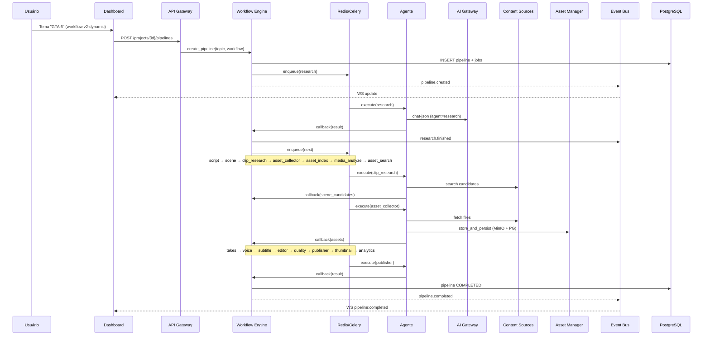
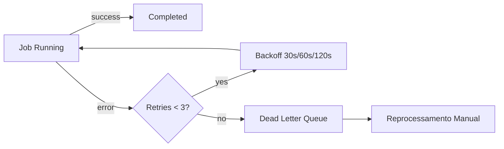

# ContentOS — Fluxo do Pipeline

## Regra de ouro

```
Dashboard → API Gateway → Workflow Engine → Redis/Celery → Agente
Agente → callback HTTP → Workflow Engine → DB + Event Bus → Dashboard
```

**Proibido:** Agente A → Agente B (direto).

---

## Sequência (V2 Dynamic)



---

## Templates

| Template | Steps | Uso |
|----------|-------|-----|
| `v1-default` | 9 | Pipeline clássico (compat) |
| `v2-full` | 9 + async | V1 + clip/thumbnail/analytics async |
| `v2-dynamic` | 16 | Pipeline completo da missão |

```env
DEFAULT_WORKFLOW=v1-default
# ou v2-dynamic para produção completa
```

---

## Pipeline V1 (9 steps)

```
research → script → scene → takes → voice → subtitle → editor → quality → publisher
```

## Pipeline V2 Dynamic (16 steps)

```
research
  ↓
script
  ↓
scene
  ↓
clip_research      ← Content Sources (candidatos, sem download)
  ↓
asset_collector    ← fetch + MinIO + PostgreSQL (AssetPipelineService)
  ↓
asset_index        ← tags / indexação
  ↓
media_analyze      ← análise IA, perfis de mídia e metadados técnicos
  ↓
asset_search       ← busca os melhores assets indexados por cena
  ↓
takes              ← só seleção (não pesquisa mídia)
  ↓
voice
  ↓
subtitle
  ↓
editor             ← 1080x1920 @ 60fps H264
  ↓
quality            ← validação + retry editor
  ↓
publisher          ← dry_run por padrão
  ↓
thumbnail          ← ImageProvider via AI Gateway
  ↓
analytics          ← Analytics AI
```

Dashboard: **Produção** (`/jobs`) e **Orquestração** (`/workflow`).

---

## Retry & DLQ



## Quality — loop de correção

Se Quality falhar, o Workflow reenvia **apenas o step com erro**:

| Falha | Reenvia para |
|-------|-------------|
| Áudio ausente | voice |
| Legenda ausente | subtitle |
| Resolução incorreta | editor |
| Arquivo corrompido | step que gerou o asset |

---

## Cancelar / Excluir

| Ação | API | Dashboard |
|------|-----|-----------|
| Parar | `POST /api/v1/pipelines/{id}/cancel` | Produção → **Parar** |
| Excluir | `DELETE /api/v1/pipelines/{id}` | Produção → **Excluir** |

Cancelamento marca jobs como `cancelled` e revoga tasks Celery.


