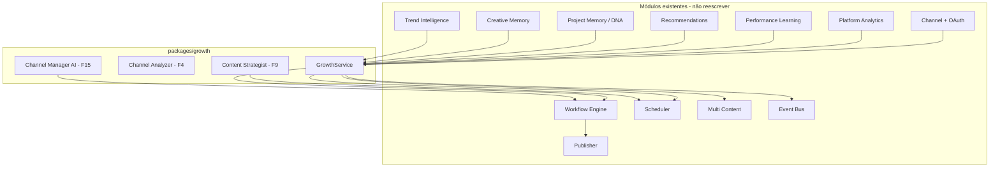

# Growth OS — Auditoria Arquitetural (Fase 1)

| Campo | Valor |
|-------|--------|
| **Data** | 2026-07-09 |
| **Fase** | 1 — Auditoria Arquitetural |
| **Status** | Concluída |
| **Regras** | [GROWTH_OS_RULES.md](./GROWTH_OS_RULES.md) |
| **Roadmap** | [GROWTH_OS_ROADMAP.md](./GROWTH_OS_ROADMAP.md) |

---

## Objetivo

Evoluir o ContentOS de fábrica de vídeos para Sistema Operacional de crescimento de canais **sem reescrever** módulos existentes.

`packages/growth/` é o cérebro estratégico. Ele decide; os demais módulos executam.

---

## Princípio arquitetural

Growth **não substitui:** Workflow Engine, AI Gateway, Asset Manager, Learning, Knowledge Base, Creative Memory, Publisher, Analytics, Content Score, AI Director, Auto Retry, Quality, Editor, Trend Intelligence, Recommendation Engine, Event Bus, Scheduler ou Dashboard.

Alterações em módulos existentes seguem [Regra 4](./GROWTH_OS_RULES.md#regra-4--evolução-aditiva-e-compatível): aditivas, compatíveis e necessárias.

---

## Mapa de módulos

### Legenda

| Status | Significado |
|--------|-------------|
| **EXISTS** | Implementado e utilizável |
| **PARTIAL** | Foundation presente; gaps funcionais |
| **MISSING** | Não implementado |

---

### 1. packages/growth/ — PARTIAL

| Item | Status | Evidência |
|------|--------|-----------|
| Domínio | EXISTS | `packages/growth/src/contentos_growth/domain.py` |
| Service | PARTIAL | `application/service.py` — fallbacks heurísticos quando DB vazio |
| Repository | PARTIAL | `infrastructure/sqlalchemy_repository.py` — leitura; poucos writes |
| Tabelas (7) | EXISTS | migration `024_growth_foundation.py` |
| APIs Growth | EXISTS | `apps/backend/.../routes/growth.py` |
| Testes | EXISTS | `tests/test_growth_foundation.py` |

**Gaps:** `growth_reports`, `growth_asset_performance`, `growth_content_calendar` sem write paths; Growth não consome recommendation engine nem platform analytics ainda.

---

### 2. Channels — EXISTS

| Item | Status | Evidência |
|------|--------|-----------|
| Modelo `Channel` | EXISTS | `packages/database/.../models.py` |
| `GET /channels` | EXISTS | `routes/channels.py` |
| `GET /channels/{id}` | EXISTS | idem |
| `POST /channels` | EXISTS | idem |
| `PUT /channels/{id}` | EXISTS | idem |
| `DELETE /channels/{id}` | EXISTS | idem |
| `GET /growth/channels` | EXISTS | enriquece com score/profile |
| Dashboard `/channels` | EXISTS | CRUD + status OAuth |
| Testes | EXISTS | `tests/test_channels_api.py` |

**Mapeamento canônico:** `Channel` = SocialChannel = ConnectedAccount (credenciais em `Channel.credentials`).

---

### 3. OAuth — EXISTS

| Item | Evidência |
|------|-----------|
| Rotas | `routes/oauth.py` |
| Token refresh | `oauth_tokens.refresh_channel_token_if_needed` |
| Plataformas | `oauth_providers.py` — youtube, tiktok, instagram |
| Storage | `Channel.credentials` JSON |
| Dashboard | `PublishConnections.tsx` |

---

### 4. Publisher — EXISTS

| Item | Evidência |
|------|-----------|
| Handler | `handlers/publisher.py` |
| Modos | `dry_run`, `prepare_only`, `live` |
| Plugins | `plugins/platforms/youtube.py`, `tiktok.py`, `instagram.py` |
| Audit | `platform_publications` |
| API | `routes/publish.py` |

---

### 5. Scheduler — EXISTS

| Item | Evidência |
|------|-----------|
| Modelo | `PipelineSchedule` |
| API | `routes/schedules.py` |
| Runner | `scheduler_service.run_due_schedules()` |
| Dashboard | `ProjectSchedules.tsx` |

**Nota:** `growth_content_calendar` é camada estratégica (Fase 9/13), separada de `PipelineSchedule` (execução).

---

### 6. Analytics — EXISTS

| Item | Status | Evidência |
|------|--------|-----------|
| Snapshots | EXISTS | `PlatformAnalyticsSnapshot` |
| Sync OAuth | EXISTS | `platform_analytics/service.py` |
| YouTube fetcher completo | EXISTS | `platform_analytics/youtube.py` |
| Rotas YouTube por canal | EXISTS | `routes/youtube_channel.py` |
| API analytics geral | EXISTS | `routes/platform_analytics.py` |
| Dashboard sync YouTube | EXISTS | `/channels` — painel YouTube |

**Fase 3 concluída:** canal YouTube real pode ser conectado (OAuth) e sincronizado.

---

### 7. Memory — EXISTS

| Camada | Evidência |
|--------|-----------|
| Project Memory | `project_memory`, `routes/memory.py`, `packages/memory/` |
| Creative Memory | `handlers/creative_memory.py`, `routes/creative_memory.py` |
| DNA | `routes/project_dna.py`, campos em `ProjectMemory` |

**Fase 5:** estender DNA (missão, valores, regras) — não criar Brand Intelligence paralelo.

**Fase 6:** Channel Memory por `channel_id` — **MISSING**.

---

### 8. Learning — EXISTS

| Item | Evidência |
|------|-----------|
| Pipeline learning | `handlers/learning.py`, `learning/service.py` |
| Performance Learning | `performance_learning/service.py`, `routes/performance_learning.py` |
| Auto-process pós-sync | `PERFORMANCE_LEARNING_AUTO_PROCESS` |

**Fase 14:** Growth interpreta; Learning já coleta e indexa.

---

### 9. Workflow — EXISTS

| Item | Evidência |
|------|-----------|
| Engine | `workflow-engine/engine.py` |
| `context_json` | `Pipeline.context_json`, migration `023` |
| API interna | `POST /internal/pipelines` |
| Templates | `v1-default`, `v2-dynamic`, `factory-full` |

**Fase 10:** contrato `context_json` documentado em `GROWTH_OS_RULES.md`.

---

### 10. Brand / DNA — PARTIAL (Fase 5)

| Campo | Status |
|-------|--------|
| tom, vocabulário, nicho, persona, pace, CTA | EXISTS |
| visual_style, brand_keywords, cinematic_preset | EXISTS |
| missão, objetivos, valores, regras editoriais | **MISSING** |

---

### 11. Competitors — PARTIAL

| Item | Status |
|------|--------|
| `growth_competitors` + CRUD | EXISTS |
| Dashboard | EXISTS |
| Análise de padrões / sync externo | **MISSING** |

---

### 12. Multi Content / Posts — EXISTS

| Item | Evidência |
|------|-----------|
| Texto (5 formatos) | `handlers/multi_content.py` |
| Vídeo por plataforma | `handlers/multi_content_video.py` |
| API | `routes/multi_content.py` |

**Fase 12:** Post Manager orquestra Multi Content — não recria geração.

---

### 13. Recommendations — EXISTS (intelligence) / PARTIAL (Growth)

| Sistema | Evidência |
|---------|-----------|
| Intelligence | `recommendations/service.py`, `GET /projects/{id}/recommendations` |
| Growth | `GET /growth/recommendations` — heurística paralela |

**Risco ALTO:** duplicação. Fase 8 deve delegar ao recommendation engine.

---

### 14. Trend Intelligence — EXISTS

| Item | Evidência |
|------|-----------|
| Agent | `handlers/trend_intelligence.py` |
| Forecast | `trend_forecast/service.py`, `routes/trend.py` |

---

### 15. Event Bus (Growth) — MISSING

Event bus EXISTS (`packages/events/`). Nenhum tipo `growth.*` definido ainda.

Sugestão: `channel.connected`, `channel.analyzed`, `growth.report.generated`, `growth.plan.created`.

---

### 16. Billing / Multi-tenant / RBAC — EXISTS

| Item | Evidência |
|------|-----------|
| Organizations | `Organization`, `OrganizationMember` |
| Billing | `billing_service.py`, `routes/billing.py` |
| RBAC | `require_editor()`, `require_org_admin()` |
| Quotas | `quota_service.py` |

---

### 17. Dashboard Growth — PARTIAL

| Página | Status |
|--------|--------|
| `/growth` | EXISTS |
| `/channels` | PARTIAL — schema drift |
| `/competitors` | EXISTS |
| `/strategy` | PARTIAL — UI espera `positioning` inexistente na API |
| Brand, Calendar, Performance, History | **MISSING** |

---

## Classificação por fase do roadmap

| Fase | Status geral | Nota |
|------|--------------|------|
| 1 Auditoria | **CONCLUÍDA** | este documento |
| 2 Channel Registry | **CONCLUÍDA** | PUT, GET/{id}, dashboard CRUD, testes |
| 3 YouTube | **CONCLUÍDA** | sync, playlists, Shorts, snapshots, rotas dedicadas |
| 4 Channel Analyzer | **CONCLUÍDA** | agente, APIs, persistência, dashboard |
| 5 Brand Intelligence | PARTIAL | estender DNA |
| 6 Channel Memory | MISSING | |
| 7 Competitors | PARTIAL | CRUD only |
| 8 Growth Report | PARTIAL | estrutura sem sinais reais |
| 9 Content Strategist | MISSING | |
| 10 Factory Integration | PARTIAL | `context_json` EXISTS |
| 11 Multi Platform | PARTIAL | 3 OAuth; analytics variável |
| 12 Post Manager | PARTIAL | Multi Content EXISTS |
| 13 Smart Scheduler | PARTIAL | scheduler EXISTS; bridge MISSING |
| 14 Performance Learning | EXISTS | Growth interpreta depois |
| 15 Channel Manager AI | MISSING | |
| 16 Multi Channel | PARTIAL | multi Channel EXISTS; isolamento incompleto |
| 17 Growth Dashboard | PARTIAL | 4/10 telas |
| 18 Hardening | PARTIAL | testes parciais |

---

## Riscos de duplicação

| Risco | Severidade | Mitigação |
|-------|------------|-----------|
| `SocialChannel` / `ConnectedAccount` vs `Channel` | **ALTA** | Usar `Channel` canônico |
| Growth recommendations vs intelligence recommendations | **ALTA** | Delegar em Fase 8 |
| Brand Intelligence vs Project DNA | **MÉDIA** | Estender `project_memory` |
| `growth_content_calendar` vs `PipelineSchedule` | **MÉDIA** | Separação estratégia/execução |
| `growth_asset_performance` vs `platform_analytics_snapshots` | **MÉDIA** | Agregar, não recoletar |
| Growth enfileirar Celery | **ALTA** | Sempre via Workflow Engine |

---

## Dependências entre módulos (Growth consome)

---

## Foundation já entregue (pré-Fase 1)

| Entrega | Status |
|---------|--------|
| `packages/growth/` | EXISTS |
| Migration 024 | EXISTS |
| APIs `/growth/*` | EXISTS |
| Dashboard Growth/Channels/Competitors/Strategy | PARTIAL |
| `tests/test_growth_foundation.py` | EXISTS |

---

## Próximo passo aprovável

**Fase 4 — Channel Analyzer** (após aprovação):

1. Estender Project DNA (`project_memory`) — missão, objetivos, valores, regras
2. Não criar módulo Brand Intelligence paralelo
3. Injetar em prompts via `BaseAgentHandler.render_prompt()`
