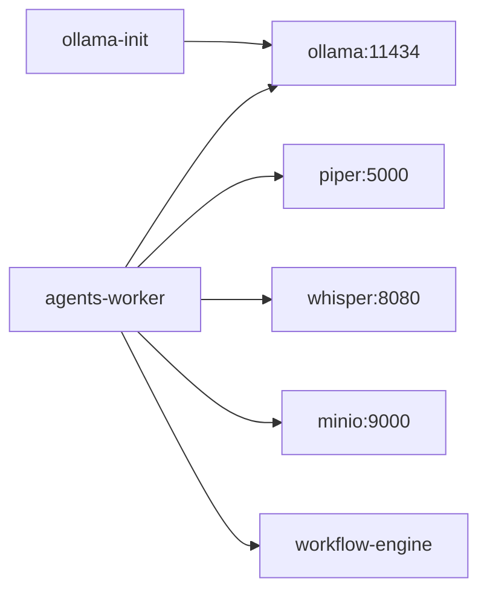

# ContentOS — Stack IA Local (Fase 2)

Pipeline **100% gratuito** — sem OpenAI, ElevenLabs ou APIs pagas.

---

## Serviços

| Serviço | Porta | Função | Modelo |
|---------|-------|--------|--------|
| **Ollama** | 11434 | LLM (roteiros, cenas) | `qwen2.5:7b` (ou `qwen3:8b`) |
| **Piper** | 5000 | TTS narração PT-BR | `pt_BR-faber-medium` |
| **Whisper** | 8080 | Legendas STT | `large-v3` |

---

## Subir stack completa

```powershell
cd ContentOS
copy .env.example .env
docker compose -f docker/docker-compose.yml up -d --build
```

### Primeira execução (importante)

| Serviço | Tempo estimado |
|---------|----------------|
| Ollama pull | 3–8 min (~4 GB) |
| Piper | ~1 min (build) |
| Whisper large-v3 | **10–20 min** (download ~3 GB + load) |

Aguarde todos os serviços:

```powershell
pip install httpx
python scripts/wait_for_services.py
```

---

## Validar providers

```powershell
curl http://localhost:8000/api/v1/providers/health
```

Dashboard: http://localhost:3000/providers

---

## Pipeline E2E

```powershell
python scripts/e2e_pipeline.py
```

Executa os 9 agentes com stack local. Timeout padrão: 60 min (CPU).

Variáveis:

```env
E2E_TOPIC=GTA 6
E2E_TIMEOUT_SECONDS=3600
E2E_POLL_SECONDS=15
```

---

## GPU (opcional)

Com NVIDIA GPU:

```powershell
docker compose -f docker/docker-compose.yml -f docker/docker-compose.gpu.yml up -d
```

Acelera Ollama e Whisper significativamente.

---

## Dev rápido (Whisper menor)

Para testes mais rápidos, use modelo menor:

```env
WHISPER_MODEL=small
WHISPER_COMPUTE_TYPE=int8
```

Reinicie apenas o serviço whisper.

---

## Troubleshooting

| Problema | Solução |
|----------|---------|
| `ollama-init` falhou | `docker compose run ollama-init` |
| Whisper timeout | Aguarde 20 min na 1ª vez; verifique logs: `docker logs contentos-whisper-1` |
| Piper sem voz | Verifique build: `curl http://localhost:5000/health` |
| Pipeline falha no research | Modelo não pulled: `docker exec -it contentos-ollama-1 ollama list` |

---

## Arquitetura Docker



`agents-worker` só inicia após `ollama-init`, `piper` e `whisper` estarem healthy.
