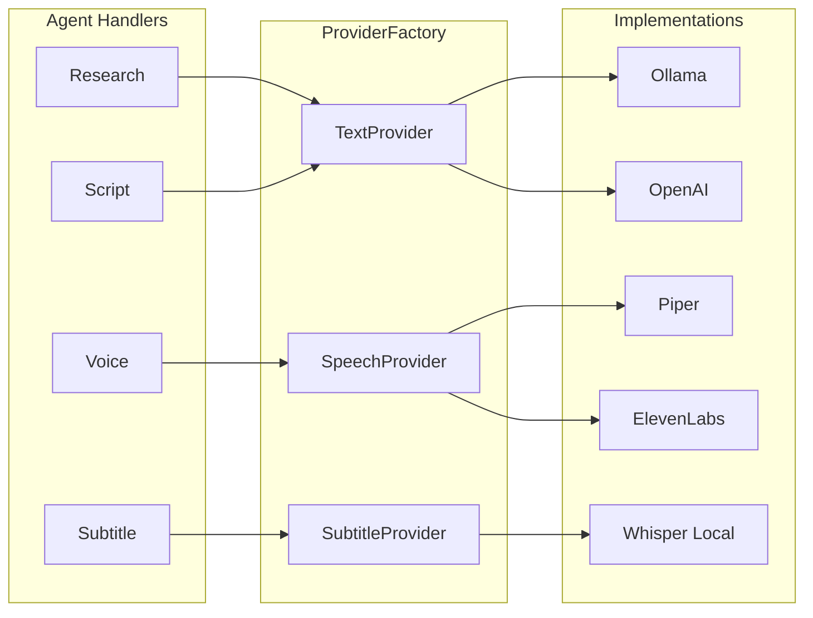

# ContentOS — AI Providers

## Princípio

**Agentes nunca chamam Ollama, Whisper ou Piper diretamente.**

Toda IA passa pela camada de Providers via `ProviderFactory` (Strategy + Dependency Injection).

```
Agent Handler
    ↓
BaseAgentHandler.get_text_provider()
    ↓
ProviderFactory.text()
    ↓
OllamaTextProvider | OpenAITextProvider
```

---

## Estrutura

```
packages/shared/src/contentos_shared/providers/
├── protocols.py          # TextProvider, SpeechProvider, SubtitleProvider
├── factory.py            # ProviderFactory + get_provider_factory()
├── ai/
│   ├── ollama.py         # Ollama + Qwen3 (default)
│   └── openai.py         # OpenAI GPT (alternativa)
├── speech/
│   ├── piper.py          # Piper TTS (default)
│   └── elevenlabs.py     # ElevenLabs (alternativa)
└── subtitle/
    ├── local_whisper.py  # Whisper large-v3 local (default)
    └── openai_whisper.py # OpenAI Whisper API (alternativa)
```

Storage usa `packages/storage/` com `StorageProvider` / MinIO — separado dos providers de IA.

---

## Configuração (.env)

```env
# Defaults — stack 100% local
TEXT_PROVIDER=ollama
SPEECH_PROVIDER=piper
SUBTITLE_PROVIDER=local

OLLAMA_BASE_URL=http://ollama:11434
OLLAMA_MODEL=qwen3

PIPER_URL=http://piper:5000
PIPER_VOICE=pt_BR-faber-medium

WHISPER_URL=http://whisper:8080
WHISPER_MODEL=large-v3
```

---

## Trocar Provider (sem alterar agentes)

### Hoje: Ollama → Amanhã: OpenAI

```env
TEXT_PROVIDER=openai
OPENAI_API_KEY=sk-...
OPENAI_MODEL=gpt-4o
```

### Hoje: Piper → Amanhã: ElevenLabs

```env
SPEECH_PROVIDER=elevenlabs
ELEVENLABS_API_KEY=...
```

Reinicie apenas o `agents-worker`. Nenhum handler precisa mudar.

---

## Criar novo Provider

1. Implemente o Protocol em `protocols.py`:

```python
class TextProvider(Protocol):
    async def chat_json(self, system: str, user: str) -> dict[str, Any]: ...
```

2. Crie adapter em `providers/ai/meu_provider.py`

3. Registre no factory:

```python
_TEXT_REGISTRY["meu_provider"] = MeuTextProvider
```

4. Configure: `TEXT_PROVIDER=meu_provider`

5. Adicione testes em `tests/test_providers.py`

---

## API

```
GET /api/v1/providers/status
```

Retorna providers ativos e opções disponíveis. Dashboard em `/providers`.

---

## Diagrama


