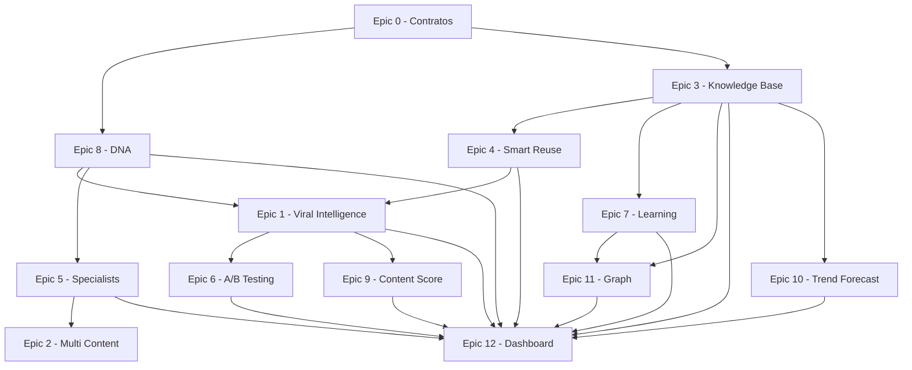

# ContentOS V4 — Roadmap de Inteligência de Conteúdo

| Campo | Valor |
|-------|--------|
| **Visão** | Plataforma SaaS de inteligência de conteúdo — maximizar probabilidade de viralização com IA |
| **Base** | [V4_CONSOLIDATION_MAP.md](./V4_CONSOLIDATION_MAP.md) |
| **Decisões** | [ADR.md](./ADR.md) — ADR-008 |
| **V3 concluído** | [ROADMAP.md](./ROADMAP.md) (Tiers A–E) |
| **Regra** | 100% aditivo. Nunca quebrar V1/V2/V3. Aprovação humana entre fases. |

---

## Princípio de execução

```
Epic 0 (fundação) → Fase V4.0 → Fase V4.1 → Fase V4.2 → Fase V4.3
       ↓                  ↓            ↓            ↓            ↓
  contratos + mapa    DNA + KB      otimização   expansão     escala
```

Cada fase entrega valor isolado. Nenhuma fase depende de código de fases futuras — apenas de interfaces definidas no Epic 0.

---

## Epic 0 — Fundação (CONCLUÍDO neste pacote)

**Objetivo:** definir contratos, consolidação V3→V4 e template opt-in antes de código de produto.

| Entrega | Status | Arquivo |
|---------|--------|---------|
| Mapa de consolidação V3→V4 | ✅ | [V4_CONSOLIDATION_MAP.md](./V4_CONSOLIDATION_MAP.md) |
| ADR-008 — V4 aditivo + pacote intelligence | ✅ | [ADR.md](./ADR.md) |
| Roadmap de fases V4.0–V4.3 | ✅ | Este documento |
| Pacote `contentos_intelligence` (interfaces) | ✅ | `packages/intelligence/` |
| Template `v4-intelligence` (step composto) | 🔜 V4.0.2 | `workflow_templates.py` |

**Critério de saída Epic 0:** documentação aprovada + interfaces publicadas + template vazio registrado.

---

## Fase V4.0 — Fundação de inteligência

**Objetivo:** memória rica, conhecimento pesquisável e reuso antes de novos scores.

| ID | Epic | Escopo | Estende (V3) | Novo | Esforço |
|----|------|--------|--------------|------|---------|
| **V4.0.1** | Epic 0 (código) | Pacote `packages/intelligence/` com interfaces DI | `shared`, `ai-core` | `IViralityScorer`, `IKnowledgeQuery`, `ISpecialistSelector`, `IContentScorer`, `IReuseAdvisor` | P | **DONE** |
| **V4.0.2** | Epic 8 — Project DNA | Tom, velocidade, humor, cores, narrador, formato favorito | `ProjectMemory`, `memory_service` | Campos DNA + injeção automática em todos os prompts | M | **DONE** |
| **V4.0.3** | Epic 3 — Knowledge Base | Roteiros, hooks, assets, analytics indexados | `AssetIndexService`, `Script`, `AnalyticsInsight` | `EmbeddingIndex`, `SemanticSearch`, `ContentHistory`, `VersionHistory` | G | **DONE** |
| **V4.0.4** | Epic 4 — Smart Reuse | Sugestão pré-geração (roteiro, hook, asset, CTA) | KB + Memory | `ReuseAdvisor` agent/handler | M | **DONE** |
| **V4.0.5** | Epic 1 — Viral Intelligence | Relatório único pré-editor | `hook`, `emotion`, `trend_intelligence`, `quality_scoring` | `ViralEngine`, analisadores, `viral_report` no payload | G | **DONE** |

### Step composto: `content_intelligence`

Um único step Celery orquestra internamente (por DI, não por acoplamento direto):

```
content_intelligence
├── specialist_selector  (Epic 5) ✅ V4.1.3
├── reuse_advisor        (Epic 4)
├── viral_engine         (Epic 1)
├── ab_variants          (Epic 6) ✅ V4.1.1
└── content_score        (Epic 9) ✅ V4.1.2
```

**Posição no pipeline:** após `emotion` (ou `script_review`), **antes** de `scene` / `editor`.

**Template novo:** `v4-intelligence` = `v3-quality` com step `content_intelligence` inserido.

| Template | Steps | Compatibilidade |
|----------|-------|-----------------|
| `v1-default` | 9 | Inalterado |
| `v2-dynamic` | 14 | Inalterado |
| `v3-quality` | 16 | Inalterado |
| `v4-intelligence` | 17 | Opt-in; herda flags `v3-quality` |

### Entregáveis por epic (V4.0)

| Epic | API | Agent/Handler | Docs | Testes | Dashboard |
|------|-----|---------------|------|--------|-----------|
| 8 DNA | `GET/PATCH /projects/{id}/dna` | injeção em `BaseAgentHandler` | `PROJECT_DNA.md` | `test_project_dna.py` | `/projects/[id]/dna` |
| 3 KB | `/knowledge/search`, `/knowledge/history` | indexação pós-pipeline | `KNOWLEDGE_BASE.md` | `test_knowledge_base.py` | `/knowledge` |
| 4 Reuse | `/reuse/suggest` | step ou pré-hook | `SMART_REUSE.md` | `test_smart_reuse.py` | widget no projeto |
| 1 Viral | `/viral/analyze` | `content_intelligence` handler | `VIRAL_INTELLIGENCE.md` | `test_viral_intelligence.py` | `/viral` |

**Critério de saída V4.0:** ✅ concluído — `v4-intelligence` (17 steps), `viral_report` + `reuse_suggestions` no step `content_intelligence`.

---

## Fase V4.1 — Otimização automática

**Objetivo:** variantes, nota unificada e especialistas sem explodir o pipeline.

| ID | Epic | Escopo | Estende (V3) | Esforço |
|----|------|--------|--------------|---------|
| **V4.1.1** | Epic 6 — A/B Testing | 3 hooks, títulos, CTAs, thumbnails, openers | `hook`, `thumbnail` | G | **DONE** |
| **V4.1.2** | Epic 9 — Content Score | Nota 0–100 agregada | `quality_scoring`, `video_review`, `viral_report` | M | **DONE** |
| **V4.1.3** | Epic 5 — Specialists (piloto) | Gaming, Tech, Business (3 de 11) | `agent_catalog`, `prompt_service` | M | **DONE** |

### Entregáveis Epic 6 (V4.1.1) — DONE

| API | Handler | Docs | Testes | Dashboard |
|-----|---------|------|--------|-----------|
| `POST /ab-variants/generate`, `GET /ab-variants/pipeline/{id}` | `content_intelligence` + thumbnail concept | `AB_TESTING.md` | `test_ab_testing.py` | `/ab-testing` |

Evento: `ab.variant.selected`

### Entregáveis Epic 9 (V4.1.2) — DONE

| API | Handler | Docs | Testes | Dashboard |
|-----|---------|------|--------|-----------|
| `POST /content-score/score` | `content_intelligence` (preview) | `CONTENT_SCORE.md` | `test_content_score.py` | `/content-score` |

Evento: `content_score.computed`

### Entregáveis Epic 5 (V4.1.3) — DONE

| API | Handler | Docs | Testes | Dashboard |
|-----|---------|------|--------|-----------|
| `GET /specialists`, `POST /specialists/select` | `content_intelligence` + `BaseAgentHandler` | `SPECIALISTS.md` | `test_specialists.py` | `/specialists` |

Evento: `specialist.selected`

### Epic 9 — modelo de score unificado

Não criar quarto sistema independente. Fachada `ContentScoreService`:

| Dimensão | Fonte V3/V4 | Peso sugerido |
|----------|-------------|---------------|
| Hook | `viral_report.hook_score` | 15% |
| Retenção | `viral_report.retention_prediction` | 15% |
| Emoção | payload `emotion` | 10% |
| CTA | DNA + script | 10% |
| SEO | (V4.2 multi-content) | 10% |
| Título | A/B winner | 10% |
| Thumbnail | A/B + quality | 10% |
| Qualidade técnica | `quality_score` (0–10 → 0–100) | 10% |
| Originalidade | KB similarity inverse | 5% |
| Ritmo | `viral_report.rhythm` | 5% |

**Critério de saída V4.1:** ✅ concluído — A/B persiste variantes; score 0–100 no payload; workflow seleciona specialist por nicho automaticamente.

---

## Fase V4.2 — Expansão de formatos e aprendizado

**Objetivo:** um roteiro → múltiplos formatos; fechar loop pós-pipeline.

| ID | Epic | Escopo | Esforço |
|----|------|--------|---------|
| **V4.2.1** | Epic 2a — Multi Content (texto) | Thread X, LinkedIn, Newsletter, SEO article, Email | G | **DONE** |
| **V4.2.2** | Epic 2b — Multi Content (vídeo) | TikTok, Shorts, Reels metadata + variantes render | G | **DONE** |
| **V4.2.3** | Epic 7 — Learning Engine | Pós-pipeline: prompt, specialist, hook, CTA → Memory + KB | M | **DONE** |
| **V4.2.4** | Epic 10 — Trend Forecast | Evoluir `trend_intelligence` com score e growth | M | **DONE** |

### Epic 2 — fatiamento

| Sub-epic | Formatos | Reutiliza |
|----------|----------|-----------|
| **2a** | thread, linkedin, newsletter, seo_article, email_marketing | mesmo `Script.full_text` |
| **2b** | tiktok, youtube_shorts, instagram_reels, carousel, podcast_script | mesmo render + metadata/crops |

Cada formato = prompt em `packages/prompts/prompts/` + handler em `packages/intelligence/` ou `agents-worker`.

### Entregáveis Epic 2a (V4.2.1) — DONE

| API | Handler | Docs | Testes | Dashboard |
|-----|---------|------|--------|-----------|
| `POST /multi-content/generate`, `GET /multi-content/pipeline/{id}` | `multi_content` step + template `v4-multi-text` | `MULTI_CONTENT.md` | `test_multi_content.py` | `/multi-content` |

Evento: `multi_content.generated`

**Critério parcial V4.2:** ✅ 1 pipeline produz ≥5 artefatos texto (`v4-multi-text`) e ≥3 variantes vídeo (`v4-multi-full`).

### Entregáveis Epic 2b (V4.2.2) — DONE

| API | Handler | Docs | Testes | Dashboard |
|-----|---------|------|--------|-----------|
| `POST /multi-content/video-variants/generate`, `GET /multi-content/video-variants/pipeline/{id}` | `multi_content_video` step + template `v4-multi-full` | `MULTI_CONTENT.md` | `test_multi_content_video.py` | `/multi-content` (aba Vídeo) |

Evento: `video_variants.generated`

### Entregáveis Epic 7 (V4.2.3) — DONE

| API | Handler | Docs | Testes | Dashboard |
|-----|---------|------|--------|-----------|
| `POST /learning/record`, `GET /learning/pipeline/{id}`, `GET /learning/insights` | `learning` async pós-pipeline | `LEARNING_ENGINE.md` | `test_learning_engine.py` | `/learning` |

Evento: `learning.recorded`

### Entregáveis Epic 10 (V4.2.4) — DONE

| API | Handler | Docs | Testes | Dashboard |
|-----|---------|------|--------|-----------|
| `POST /trend/forecast`, `GET /trend/forecast/pipeline/{id}` | `trend_intelligence` (extend) | `TREND_FORECAST.md` | `test_trend_forecast.py` | `/trend-forecast` |

Evento: `trend.forecasted`

**Critério parcial V4.2:** ✅ fase V4.2 completa (texto, vídeo, learning, trend).

### Entregáveis Epic 11 (V4.3.1) — DONE

| API | Handler | Docs | Testes | Dashboard |
|-----|---------|------|--------|-----------|
| `POST /graph/build/{id}`, `GET /graph/project/{id}`, `GET /graph/neighbors` | auto-build learning + KB index | `CONTENT_GRAPH.md` | `test_content_graph.py` | `/content-graph` |

Evento: `graph.updated`

---

## Fase V4.3 — Escala e visão executiva

**Objetivo:** grafo de relacionamentos e dashboard completo.

| ID | Epic | Escopo | Esforço |
|----|------|--------|---------|
| **V4.3.1** | Epic 11 — Content Relation Graph | Vídeos, assets, roteiros, specialists, prompts | G | **DONE** |
| **V4.3.2** | Epic 12 — Executive Dashboard | Páginas: Viral, KB, DNA, Score, A/B, Trend, Specialists, Learning, Reuse, Graph | G | **DONE** |

**Pré-requisito Epic 11:** volume mínimo em KB + Learning (dados reais ou seed E2E).

**Critério de saída V4.3:** ✅ grafo consultável; dashboard executive com dados live das APIs V4.

### Entregáveis Epic 12 (V4.3.2) — DONE

| API | Handler | Docs | Testes | Dashboard |
|-----|---------|------|--------|-----------|
| `GET /executive/summary` | `ExecutiveSummaryService` | `EXECUTIVE_DASHBOARD.md` | `test_executive_dashboard.py` | `/executive` |

**Critério de saída V4:** ✅ roadmap V4.0–V4.3 completo.

---

## Mapa de dependências



---

## Ordem de implementação (aprovação sequencial)

| # | ID | Nome | Aguarda |
|---|-----|------|---------|
| 0 | V4.0.0 | Epic 0 docs + ADR | — |
| 1 | V4.0.1 | Interfaces `contentos_intelligence` | V4.0.0 ✅ |
| 2 | V4.0.2 | Project DNA | V4.0.1 |
| 3 | V4.0.3 | Knowledge Base | V4.0.1 |
| 4 | V4.0.4 | Smart Reuse | V4.0.3 |
| 5 | V4.0.5 | Viral Intelligence + `v4-intelligence` | V4.0.2, V4.0.4 |
| 6 | V4.1.1 | A/B Testing | V4.0.5 |
| 7 | V4.1.2 | Content Score | V4.0.5, V4.1.1 |
| 8 | V4.1.3 | Specialists (piloto) | V4.0.2 |
| 9 | V4.2.1 | Multi Content texto | V4.1.3 |
| 10 | V4.2.2 | Multi Content vídeo | V4.2.1 |
| 11 | V4.2.3 | Learning Engine | V4.0.3, V4.0.5 |
| 12 | V4.2.4 | Trend Forecast | V4.0.3, V4.2.3 |
| 13 | V4.3.1 | Content Graph | V4.2.3 |
| 14 | V4.3.2 | Executive Dashboard | APIs estáveis V4.0–V4.2 |

---

## Regras invariantes (V4)

1. **Nenhum agente fala com outro** — Workflow Engine orquestra.
2. **Toda IA** passa pelo AI Gateway.
3. **Todo asset** passa pelo Asset Manager.
4. **Todo evento** usa Event Bus (`content.intelligence.completed`, etc.).
5. **Módulos V4** dependem de **interfaces**, não de implementações entre si.
6. **Custo** — cada chamada LLM registra em Cost Manager; respeita quotas org.
7. **Cada fase:** impacto → ADR se necessário → docs → código → testes → Swagger → dashboard → **parar**.

---

## Estimativa de esforço

| Fase | Epics | Duração indicativa* |
|------|-------|---------------------|
| V4.0 | 0, 8, 3, 4, 1 | 4–6 sprints |
| V4.1 | 6, 9, 5 | 3–4 sprints |
| V4.2 | 2, 7, 10 | 4–6 sprints |
| V4.3 | 11, 12 | 3–4 sprints |

\*Sprint = 1 epic médio com testes + docs. Ajustar conforme equipe.

---

## Próxima implementação

**V4 concluído** — todas as fases V4.0–V4.3 implementadas.

Opcional pós-V4: integrações OAuth analytics, novos specialists, formatos multi-content (carousel, podcast).

```powershell
cd packages/database && alembic upgrade head
docker compose -f docker/docker-compose.yml up -d --build gateway workflow-engine agents-worker dashboard
```

---

## Como avançar

1. Você aprova o ID (ex.: `autorizado V4.0.1`).
2. Agente: impacto → ADR se necessário → arquivos → implementação → testes → docs → Swagger/dashboard.
3. Para e espera próxima aprovação.
